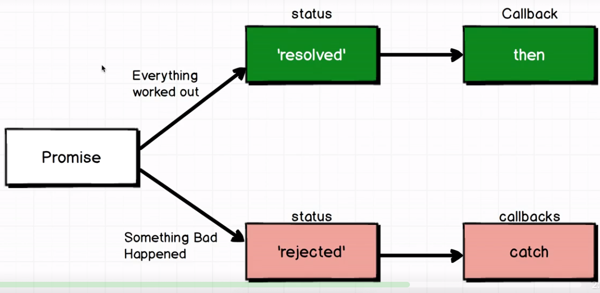

# es6-notes
ES6, ES7 versus ES5


### es6 syntactic sugar (stuff that helps to write less code)
1.Template strings

```js
// ES5
function getMessage() {
  const year = new Date().getFullYear();

  return "The year is " + year;
}

// ES6
function getMessage() {
  ...
  return `The year is ${year}`
  // or
  return `The year is ${new Date().getFullYear()}`
}

```
2.Enhanced object literals

```js
// ES5

function createBookShop(inventory) {
  return {
    inventory: inventory,
    inventoryValue: function() {
      return this.inventory.reduce((total, book) => total + book.price, 0)
    },
    priceForTitle: function(title) {
      return this.inventory.find(book => book.title === title).price;
    }
  }
}

const inventory = [
  {title: 'Harry Potter', price: 10},
  {title: 'Eloquent JS', price: 15}
]

//ES6

function createBookShop(inventory) {
  return {
    inventory,
    inventoryValue() {
      return this.inventory.reduce((total, book) => total + book.price, 0)
    },
    priceForTitle(title) {
      return this.inventory.find(book => book.title === title).price;
    }
  }
}

```
3.Default function arguments

```js
function createAdminUser(user = new User.generateId()) {
  user.admin = true;
  return user;
}

```

4.Capturing arguments with rest and spread

```js
//ES6 rest operator
function addNum(...numbers) {
  return numbers.reduce((sum, num) => {
    return sum + num;
  }, 0)
}

addNum(1,2,3,4,5,6); // tranform list of arguments into array

// spread operator
const defaultColors = ['red', 'green'];
const userFavourite = ['black', 'white'];

//ES5
defaultColors.concat(userFavourite); //['red', 'green','black', 'white']
//ES6
['blue', ...defaultColors, ...userFavourite]; // same effect

function validateShoppingList(...items) {
  if (items.indexOf('milk') < 0) {
    return ['milk', ...items];
  }
  return items;
}
validateShoppingList('orange', 'tea');

```


### es6 new features (new ideas, new functionalities in the language)

1.const, let

const - value doesn't change over time
let - value change over time

```js
// ES5
var name = 'Jane';
var title = 'Software Engineer';
var hourlyWage = 40;

// ES6
const name = 'Jane'; // name value doen't change over time
let title = 'Sofware Engineer';
let hourlyWage = 40;

// some time later
title = 'Senior Software Engineer';
hourlyWage = 45;
```

Motivation to use it: make your code instantly more readable. By only declaring variables, you straight away know which variables changes over time and which are constant. By using var you don't have any information about the specific variable.

2.Fat Arrow functions

```js
// ES5
const add = function(a, b) {
  return a + b;
}

// ES6
const add = (a, b) => a + b;
// if there is one expression there is no need to use {} curly braces

const double = num => num * 2;
// if there is only one argument passed, there is no need to use ()
```

When to use arrow functions?

- Arrow functions bind the value of 'this' to the surrounding context.
The this keyword may reference to: window (if accessed globally, not in strict mode), undefined (if accessed globally, in strict mode), an instance (if in a constructor), an object (if in a method or function inside an object or instance) or a binded/applied value.

```js
// ES5
const team = {
  members: ['Jane', 'Bill'],
  teamName: 'Super Squad',
  teamSummary: function() {
    return this.members.map(function(member) {
      return `${member} is on team ${this.teamName}`;
    }).bind(this);
  }
};

//ES6 automatic binding 'this'
const team = {
  members: ['Jane', 'Bill'],
  teamName: 'Super Squad',
  teamSummary: function() {
    return this.members.map((member) => {
      return `${member} is on team ${this.teamName}`;
    });
  }
};

// simetimes arrow function arent the solution

const profile = {
    name: 'Alex',
    getName: () => {
        return this.name; //this is undefined   
    }
};

//Since the object ```profile``` is defined at the global scope, his methods are called at the global space. If ```profile``` were the result of a Person constructor, the method would be scoped to the instance instead.

```


3.Destructuring

```js
//ES5
var expense = {
  type: 'Business',
  amount: '56'
}

var type = expense.type;
var amount = expense.amount;

//ES6
const { type, amount } = expense; //the variable name must be identials to the property of the expense

//ES5
var savedFile = {
  extension: 'jpg',
  name: 'report',
  size: 1000
}

function fileSummary(file) {
  return `The file ${file.name}.${file.extension} is of size ${file.size}`;
}
// to reduce repetition, use Destructuring
// ES6
function fileSummary({name, extension, size}) {
  return `The file ${name}.${extension} is of size ${size}`;
}

// Destructuring arrays
const companies = [
  'Google',
  'Facebook',
  'Uber'
];

const [name, name2, name3] = companies;
name; // Google
name2; // Facebook
const {length} = companies; // 3
const [ name, ...rest] = companies;
```

Destructuring Arrays and Objects at the same time.

```js

const companies = [
  {name: 'Google', location: 'Mountain View'},
  {name: 'Facebook', location: 'Menlo Park'},
  {name: 'Uber', location: 'San Fransisco'}
];

const [ {location} ] = companies;
location; //Mountain View


const Google = {
  locations: ['London', 'Paris', 'New York']
}

const { locations: [ location ] } = Google;
location; //London
```

When to use destructuring ?

```js
// no need to remember which order parameters are passed
function signup({email, password, username}) {
  ...
}

const user = {
  email: 'example@com',
  password: 'mypassword',
  username: 'username'
}

signup(user);

// -------------
const points = [
  [4, 5],
  [10, 1],
  [0, 40]
]

// we want data to be transform as below:
// [
//   {x : 4, y: 5},
//   {x : 10, y: 1},
//   {x: 0, y: 40}
// ]

points.map(([x, y]) => {
  return { x, y };
})

const classes = [
  [ 'Chemistry', '9AM', 'Mr. Darnick' ],
  [ 'Physics', '10:15AM', 'Mrs. Lithun'],
  [ 'Math', '11:30AM', 'Mrs. Vitalis' ]
];

const classesAsObject = classes.map(([subject, time, teacher]) => {
    return {subject, time, teacher};
});

```
Recursion with Destructuring

```js
//Input:
double([1,2,3])

//Output
[2,4,6]

// Dont use arrays helpers
const numbers = [1, 2, 3];

function double(numbers) {
    let [num, ...rest] = numbers;

    if (rest.length !== 0) {
        return [num * 2, ...double(rest)];
    } else {
        return [num * 2];
    }
}

//or
let [ num, ...rest ] = numbers;
return num ? [num * 2, ...double(rest)] : numbers;

```

4.Classes

```js
// ES5
function Car(options) {
  this.title = options.title;
}

Car.prototype.drive = function () {
  return 'vroom';
}

const car = new Car({title: 'Focus'})
car.drive(); // vroom

// Prototype inheritence
function Toyota(options) {
  Car.call(this, options);
  this.color = options.color;
}

Toyota.prototype = Object.create(Car.prototype);
Toyota.prototype.constructor = Toyota;

Toyota.prototype.honk = function() {
  return 'honk';
}

const toyota = new Toyota({color: 'red', title: 'Vectra'});
toyota;
toyota.drive();
toyota.honk();
```

Classes ES6 (extending behaviour):

```js
class Car {
  // this is like init or create, whenever we use new keyword we need to initialize it
  constructor(options) { // or {title}
    this.title = options.title; // remove options
  }

  drive() {
    return 'vroom';
  }
}

const car = new Car();
car.drive(); //vroom

// Inheritence
class Toyota extends Car {
  constructor(options) {
    super(options) //Car.constructor()
    this.color = options.color;
  }

  honk() {
    return 'beep';
  }
}


const toyota = new Toyota({color: 'red', title: 'Driver'});
toyota.honk(); //beep
toyota;
```


5.Generators is a function that can be entered and exited a multiple times.

WIP

```js
function* numbers() {
  yield; //keyword
}

const gen = numbers();
gen.next(); // {'done': false}
gen.next(); // {'done': true}

```
6.Promises



```js
let promise = new Promise((resolve, reject) => {
  resolve();
})

// promise has two properties
 //inside then we register callback
promise.then(() => {
  console.log('finished');
}).then(() => console.log('I was also run'))
promise.catch(() => {
  console.log('some problem');
})

```
